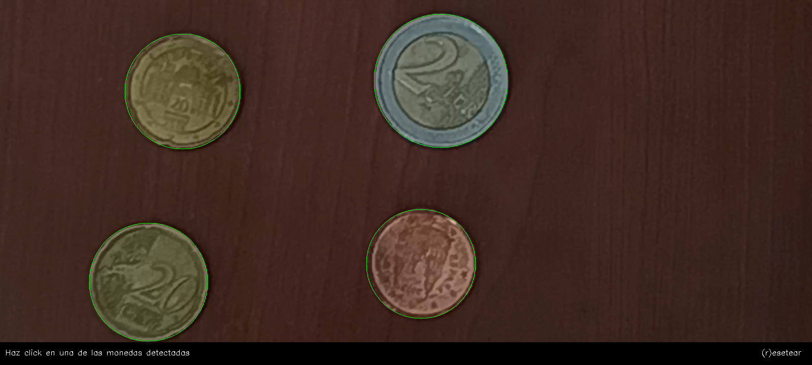

# Visión por Computador - Práctica 3

Esta práctica ha consistido en realizar una serie de tareas con el objetivo de adquirir la capacidad para extraer información geométrica de objetos presentes en una imagen, con el fin de caracterizarlos y posteriormente ser capaz de identificarlos de forma automática en categorías utilizando entre otras las herramientas de umbralizado y detección de contornos de OpenCV.

## TAREA 1: Captura una o varias imágenes con monedas no solapadas. Tras visualizar la imagen, identifica de forma interactiva (por ejemplo haciendo clic en la imagen) una moneda de un valor determinado en la imagen (por ejemplo de 1€). Tras ello, la tarea se resuelve mostrando por pantalla el número de monedas y la cantidad de dinero presentes en la imagen. No hay restricciones sobre utilizar medidas geométricas o de color. ¿Qué problemas han observado?

Esta tarea se divide en tres fases.

La primera fase consiste en obtener la imagen con las monedas, para ello se captura la entrada de la cámara y se congela un frame tras detectar la tecla de espacio. Este frame es procesado para detectar los objetos circulares presentes en la imagen. Para ello se aplica el umbralizado de Otsu, invirtiendo el resultado si hace falta, y se buscan los contornos externos para a continuación obtener el círculo mínimo que los encierra. Adicionalmente se realiza una clasificación de los mismos en base al tono de color para facilitar la distinción de monedas de tamaño similar.

La segunda fase consiste en seleccionar una moneda de referencia e indicar su valor. Para ello detecta las pulsaciones del botón izquierdo del ratón y si coincide con una posición dentro de los círculos detectados muestra una imagen de referencia y donde se detecta de nuevo las pulsaciones del botón izquierdo del ratón para saber a cuál se corresponde. Con esta información se obtiene la relación entre los píxeles de la imagen y el tamaño de las monedas en la imagen.

En la tercera y última fase se asocian los círculos encontrados con su valor, buscando el más cercano a su tamaño dentro de la clasificación en base al tono de color sin que la diferencia se pase 1mm. Finalmente se muestra el resultado de la suma.

Respecto a los problemas observados, la detección puede verse afectada dependiendo del color y textura de la superficie en la que se encuentra, la presencia de objetos extraños y sombras, así como de la iluminación.

## TAREA 2: Las tres imágenes cargadas en la celda inicial, han sido extraídas de las imágenes de mayor tamaño presentes en la carpeta. La tarea consiste en extraer características (geométricas y/o visuales) e identificar patrones que permitan distinguir las partículas de cada una de las tres clases, evaluando los aciertos y fallos con las imágenes completas considerando las métricas mostradas y la matriz de confusión. La matriz de confusión, muestra para cada clase el número de muestras que se clasifican correctamente de dicha clase, y el número de muestras que se clasifican incorrectamente por cada una de las otras dos clases.

En esta tarea se ha procesado cada imagen siguiendo los siguientes pasos.

Primero, se ha redimensionado la imagen en escala de gris a un tamaño de 1000 píxeles en su dimensión más grande manteniendo la relación ancho/alto. A continuación se ha aplicado un filtro bilateral que permite reducir el ruido sin difuminar excesivamente los bordes[^1]. Tras esto se le ha aplicado un umbralizado adaptivo promedio y realizado la detección de contornos externos.

Para clasificar los contornos obtenidos se utilizaron las siguientes características geométricas:
- Relación entre los ejes de la elipse ajustada
- Compacidad (relación del cuadrado del perímetro con el área C=P^2/A)
- Relación del área de la partícula con el área del contenedor que la contiene
- Relación del ancho y el alto del contenedor
- Definido el centroide, relación entre las distancias menor y mayor al contorno

Experimentando, se observó que los fragmentos con frecuencia poseían valores superiores de las 1ª, 2ª y 5ª características e inferiores de las otras en comparación a las bolitas y el alquitrán. Distinguir entre las bolitas y el alquitrán utilizando estás características fue más complicado ya que había solapamiento en los valores obtenidos. Para distinguirlos se hizo utilizo la característica de color de media RGB, asumiendo que los contornos candidatos a bolitas más negrizcos son en realidad alquitrán.

Los resultados obtenidos se muestran a continuación. Cabe notar que debido a imperfecciones en la segmentación existe una pequeña diferencia entre la cantidad esperada de elementos y el detectado (1 en las bolitas, 2 en el alquitrán y 5 en los fragmentos).

Como se puede observar en las imágenes, la exactitud del clasificador realizado es inferior en la imagen con solo fragmentos que en la de solo bolitas y solo alquitrán. Esto se puede deber por una parte a defectos en el clasificador y por otra parte a que la segmentación es más pobre en esta imagen ya que algunos fragmentos no contrastan lo suficiente con el fondo, lo que dificulta la clasificación. 

## Autor
Javier A. Alfonso Quintana

## Fuentes
[^1]: https://docs.opencv.org/4.x/d4/d13/tutorial_py_filtering.html
[^2]: https://ieeexplore.ieee.org/document/8976153#sec3c